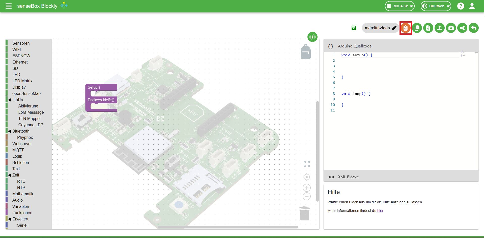
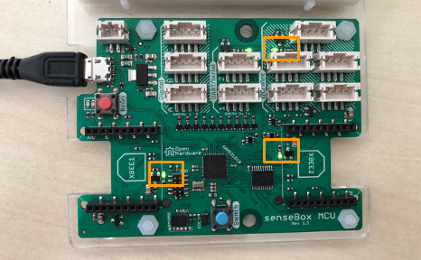
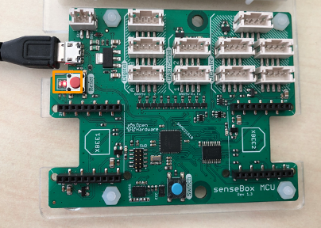
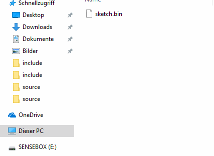
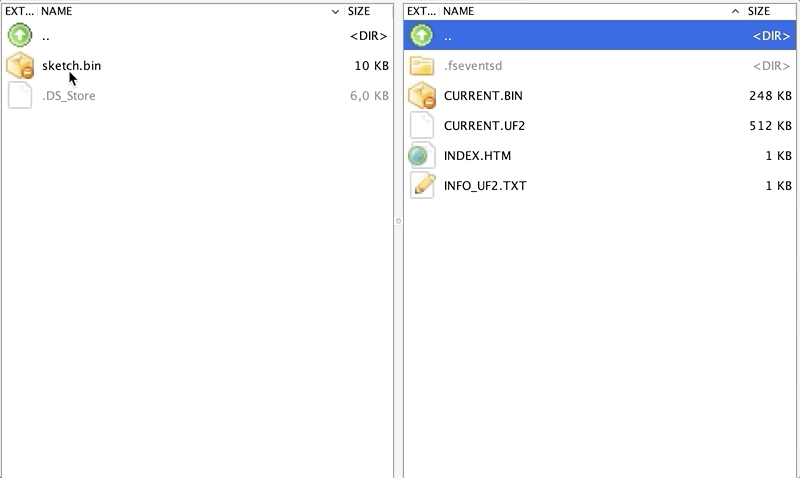

# Kompilieren und Übertragen

Nachdem du deinen ersten Sketch programmiert hast, muss dieser nun kompiliert und auf die senseBox MCU übertragen werden.

## Kompilieren
Damit dein Programm von der senseBox ausgeführt werden kann, muss es zuerst in Maschinensprache übersetzt werden. Diesen Vorgang nennt man *Kompilieren*. Im Fall der senseBox übernimmt das Kompilieren unser Server.

Um deinen Sketch kompilieren zu lassen, klicke in Blockly oben rechts auf den orangenen Knopf mit dem Notizblocksymbol.

Wenn dein Sketch fertig kompiliert ist, wird er dir in Form einer .BIN-Datei zum Download angeboten. Speichere ihn an einem Ort, wo du ihn später wiederfindest.

## Übertragen

Schließe nun deine senseBox MCU mit Hilfe des USB-Kabels an deinen Computer an. Deine senseBox startet nun automatisch im *Programm-Modus*. Den *Programm-Modus* erkennst du daran, dass die Status-LEDs auf der senseBox MCU grün leuchten.

Damit die senseBox als Wechseldatenträger erkannt wird und Programme übertragen werden können, muss diese in den *Lern-Modus* versetzt werden. Klicke dazu doppelt auf den roten Reset-Knopf auf der senseBox.

Befindet sich deine senseBox im Lern-Modus erlöschen die grünen Status-LEDs und nur eine rote LED neben dem Reset-Knopf beginnt zu leuchten/pulsieren.

#### Kopieren unter Windows & Linux

Unter Windows und Linux kannst du die zuvor heruntergeladene .BIN-Datei einfach per Drag & Drop auf den Wechseldatenträger <b>SENSEBOX</b> kopieren. Die rote LED am Button wird kurz flackern und anschließend startet das Board selbstständig neu und führt deinen Programmcode aus.

#### Kopieren unter MacOS

Unter MacOS funktioniert das Kopieren der .BIN-Datei mit dem Finder leider zurzeit noch nicht.

Eine Möglichkeit ist einen alternativen Dateimanager wie zum Beispiel [muCommander](http://www.mucommander.com/).

Erfahrene Nutzer können die Datei auch im Terminal per dd-Befehl kopieren.

> - [Blockly.senseBox.de](https://blockly.sensebox.de/)
