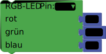

# LED

## LED
Mit dem `LED an digitalen Pin`-Block kannst du eine an einem der sechs digitalen Pins angeschlossene LED ansteuern. Im Dropdown-Menü __Pin__ wählst du den jeweiligen Pin aus und unter __Status__, ob die LED ein- oder ausgeschaltet werden soll.

> BUILTIN_1 und BUILTIN_2 sind die auf der senseBox MCU fest verbauten LEDs neben dem roten RESET-Knopf.

## RGB-LED
Mit dem `RGB-LED`Block kannst du eine an einem der sechs digitalen Pins angeschlossene RGB-LED ansteuern. Im Dropdown-Menü __Pin__ wählst du den jeweiligen Pin aus. An die Blockabschnitte __rot__, __grün__ und  __blau__ können Zahlen von 0 bis 255 angeknüpft werden, um die Intesität der verschiedenen Farbanteile festzulegen. Bei einem Wert von 0 ist kein Farbanteil vorhanden, bei einem Wert von 255 ist der maximale Farbanteil vorhanden.

> Der Farbcode für senseBox Grün lautet zum Beispiel:

## RGB-LED

Die verkettbare RGB-Led, welche über ein JST-Kabel direkt mit der senseBox MCU verbunden wird kann über folgenden Block programmiert werden:

Folgende Parameter können eingestellt werden:

- Helligkeit: Gib einen Wert zwischen 0 (dunkel/aus) und 255 (sehr hell) an. Beachte, dass die Helligkeit im Verlaufe des Programmes nicht verändert werden sollte
- Position: Sobald du mehrere RGB-LED mit einander verbunden hast kannst du hier über die Position die jeweilige LED auswähle. Beachte, dass die Position 0 der ersten LED entspricht.
- Rot/Grün/Blau: Gib einen Wert zwischen 0 und 255 an.

> - [Blockly.senseBox.de](https://blockly.sensebox.de/)