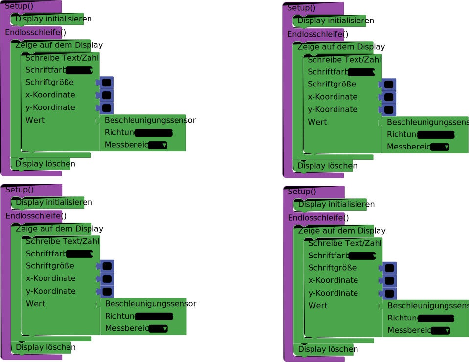
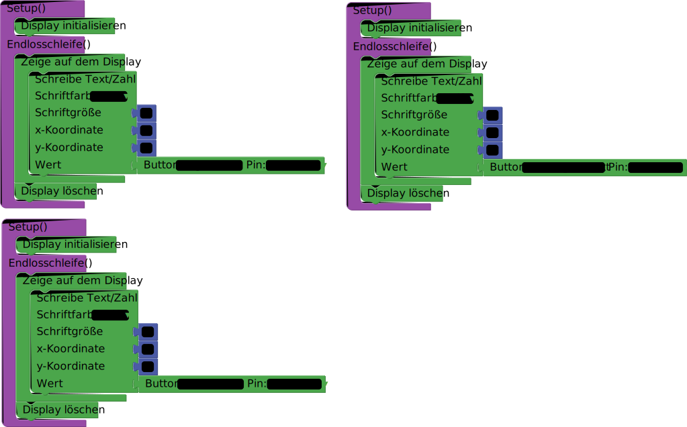
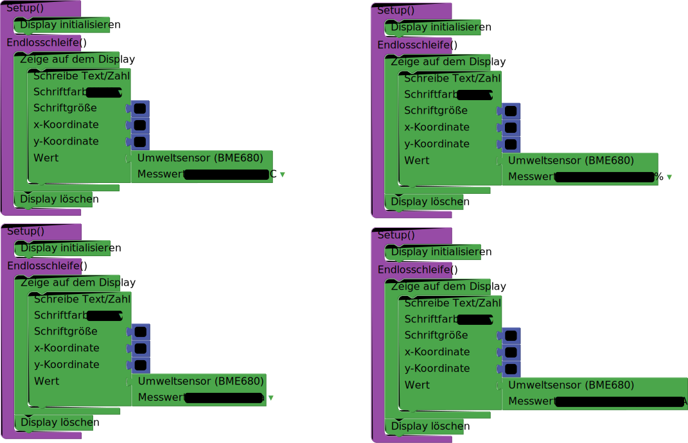
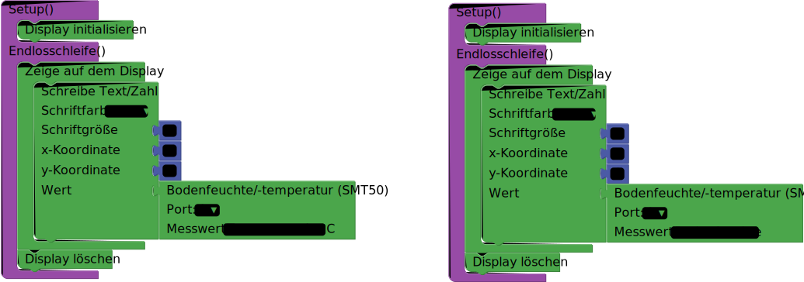

# Sensoren

## Allgemeines
In der senseBox befinden sich verschiedene Umweltsensoren. In diesem Kapitel beschränken wir uns zunächst auf die bereits auf der senseBox MCU verbauten oder per JST-Kabel anschließbaren Sensoren.

> Um Messwerte auszulesen und anzeigen zu lassen, verwendest du am besten das Display. In diesem Kapitel nutzen wir eine Art Minimalbeispiel, um Messwerte auf dem Display anzeigen zu lassen.

## Beschleunigungssensor (BMX055)
Der Beschleunigungssensor ist bereits auf der senseBox MCU verbaut. Er kann dir die Beschleunigung in X-, Y-, und Z-Achse und die Gesamtbeschleunigung angeben. Dabei kannst du den Messbereich zwischen 2g, 4g, 8g und 16g wählen.

>  Die mittlere Erdbeschleunigung wird in *g* angegeben und beträgt abgerundet 9,81 m/s2.

## Button
Ein Button ist bereits auf der senseBox MCU verbaut. Zusätzliche Buttons können über die drei Digital Ports angeschlossen werden. Im Dropdown Menü können verschiedene Modi für den Button ausgewählt werden:

- __ist gedrückt__: Mit diesem Modus kannst du abfragen, ob der Block gerade gedrückt wird. Du erhältst entweder den Wert TRUE oder FALSE.
- __wurde gedrückt__: Mit diesem Modus kannst du abfragen, ob der Block gedrückt wurde. Erst wenn der Knopf gedrückt und wieder losgelassen wurde, erhältst du TRUE zurück.
- __als Schalter__: Wenn du diesen Modus verwendest, kannst du den Knopf wie ein Lichtschalter verwenden. Der Status wird gespeichert bis der Button erneut gedrückt wird.

## Temperatur- und Luftfeuchtigkeitssensor (HDC1080)
Der Temperatur- und Luftfeuchtigkeitssensor wird an einen der fünf I2C/Wire Ports gesteckt. Er kann dir die Temperatur in °C und die relative Luftfeuchtigkeit in % angeben.

## Temperatur- und Luftdrucksensor (BMP280)
Der Temperatur- und Luftdrucksensor wird an einen der fünf I2C/Wire Ports gesteckt. Er kann dir die Temperatur in °C, den Luftdruck in Pa und die Höhe über NN in m angeben.

## Helligkeits- und UV-Sensor (TSL45315 & VEML6070)
Der Helligkeits- und UV-Sensor wird an einen der fünf I2C/Wire Ports angeschlossen. Er kann dir die Helligkeit in Lux und die UV-Intensität in &mu;W/cm2 angeben.

## Umweltsensor (BME680)
Der Umweltsensor wird an einen der fünf I2C-Wire Ports angeschlossen. Er kann dir die Temperatur in °C, die relative Luftfeuchtigkeit in %, den Luftdruck in Pa und die Innenraumluftqualität (IAQ) auf einer Skala von 0-500 angegeben.

__________________________________________________________________________
| __Wert__ |0-50|51-100|101-150|151-200|201-250|251-350|> 359|
|:---:|:---:|:---:|:---:|:---:|:---:|:---:|:---:|
| __Luftqualität__ |Ausgezeichnet|Gut|Leicht verschmutzt|Moderat verschmutzt|Stark verschmutzt|Erheblich verschmutzt|Extrem verschmutzt|
 
___________________________________________________________________________

Neben den oben genannten Parametern kann der Sensor dir zusätzlich den Kalibrierungswert (eine Statusmeldung) und Teilgrößen CO2-Äquivalent und Atemluft VOC der Innenraumluftqualität angeben.

## Feinstaubsensor (SDS011)
Der Feinstaubsensor wird an einem der zwei UART/Serial Ports angeschlossen und im Block der jeweilige Port ausgewählt. Er kann dir die Feinstaubkonzentration PM2.5 und PM10 in &mu;g/cm3 angeben.

## Bodentemperatur- und Bodenfeuchtesensor (SMT50)
Der Bodentemperatur- und Bodenfeuchtesensor wird in einen der drei Digital Ports angeschlossen und im Block der jeweilge Port ausgewählt. Er kann dir die Bodentemperatur in °C und den volumetrischen Wassergehalt des Bodens in % ausgeben.

## GPS-Modul (CAM-M8Q)
Das GPS-Modul wird an einen der fünf I2C/Wire Ports angeschlossen. Es kann dir den Breitengrad, den Längengrad, die Höhe über NN in m, die aktuelle Geschwindigkeit, einen Zeitstempel, die Uhrzeit und das Datum angeben.

## Ultraschall-Abstandssensor
Der Ultraschall-Distanzsensor wird an einen der drei Digital Ports angeschlossen und im Block der jeweilige Port ausgewählt. Er kann dir die Entfernung in cm angeben.

## Mikrofon
Das Mikrofon wird an einen der drei Digital Ports angeschlossen und im Block der jeweilige Port ausgewählt. Er kann dir die Lautstärke als Pegel zwischen 0 und 5V ausgeben.

> - [Blockly.senseBox.de](https://blockly.sensebox.de/)