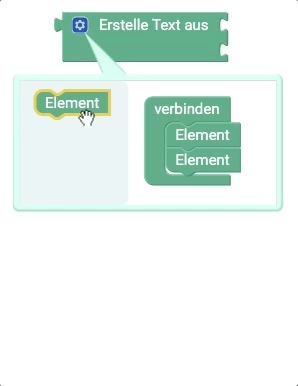

# Text

## Textfeld
Mit dem Textfeld Block `" "` kannst du Text erstellen. Schreibe den gewünschten Text dazu in das Feld zwischen den Anführungszeichen.

## Erstelle Text aus
Mit dem `Erstelle Text aus`-Block kannst du einerseits Messwerte in Text umwandeln und andererseits zusammengesetze Texte (aus mehreren Textfeldern, Zahlen, Messwerten oder Variablen) erstellen.

Der normale Erstelle-Text-Aus-Block kann mit einem Klick auf das Zahnrad erweitert werden. Du kannst noch weitere Elemente durch Klicken und Ziehen hinzufügen, um Text aus mehreren Elementen zu erstellen. Nach dem Bearbeiten kann mit einem weiteren Klick auf das Zahnrad das Fenster wieder geschlossen werden.

## Text anhängen

Mit dem `Text anhängen`-Block kannst du Text an eine bestehende Variable anhängen.

## Länge

Mit dem `Länge`-Block kannst du dir die Länge eines Textblocks ausgeben lassen.

> Der Textblock "senseBox" wäre zum Beispiel 8 Einheiten lang.

## ist leer?

Mit dem `ist leer?`-Block kannst du überprüfen, ob ein gegebener Textblock leer ist (die Länge 0 hat). Das Ergebnis ist entweder wahr (wenn der gegebene Textblock tatsächlich leer ist) oder falsch (wenn sich Zeichen im Textblock befinden).

> - [Blockly.senseBox.de](https://blockly.sensebox.de/)