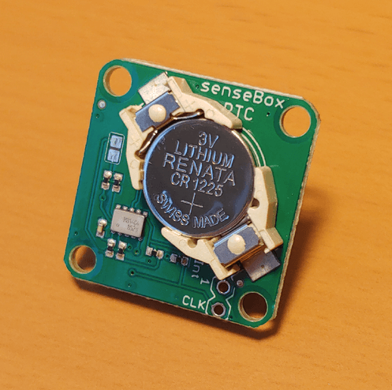

# RTC-Modul

Das RTC-Modul ermöglicht es dir, die Uhrzeit auch ohne Stromversorgung zu speichern. Dies kann besonders nützlich sein, wenn keine Internetverbindung verfügbar ist und Messwerte offline z.B. auf der SD Karte gespeichert werden sollen. Damit die Uhrzeit auch ohne Stromversorgung gespeichert werden kann, ist zudem eine Knopfzellenbatterie von Nöten.





## Anschluss

Nachdem die Knopfzellenbatterie in die Halterung eingefügt wurde, wird das RTC-Modul an einen I2C Anschluss der senseBox angeschlossen.


## Uhrzeit einrichten

Bevor du das RTC Modul verwendest, muss als Erstes die Anfangsuhrzeit gesetzt werden. Dies muss nur ein einziges Mal geschehen vorausgesetzt, die Batterie wird nicht von dem Modul getrennt. In folgendem Sketch wird die Uhrzeit und das Datum im `setup` gesetzt und im `loop` auf dem seriellen Monitor ausgegeben.
Denk dran, die aktuelle Zeit im `setup` beim Befehl `rtc.set(...)` selbst zu setzen.

```arduino
#include <RV8523.h>
//#inlcude <SenseBoxMCU.h> only use with blockly code and commend out senseBoxIO.h
#include <senseBoxIO.h>
#include <Wire.h>
#define BUFF_MAX 32

RV8523 rtc;
unsigned int recv_size = 0;
char recv[BUFF_MAX];

void setup() {
  // put your setup code here, to run once:
  Serial.begin(9600);
  delay(200);

  Serial.println("Init RTC...");
  rtc.begin();
  rtc.start();
  rtc.set24HourMode();
  rtc.set(SECOND, MINUTE, HOUR, DAY, MONTH, YEAR); // Aktuelle Uhrzeit / Datum HIER setzen!
  rtc.batterySwitchOver(1);
}


void loop()
{
  uint8_t sec, min, hour, day, month;
  uint16_t year;

  //Uhrzeit befindet sich in den einzelnen Variablen !
  rtc.get(&sec, &min, &hour, &day, &month, &year);

  //serial output
  Serial.print("\nTime: ");
  Serial.print(hour, DEC);
  Serial.print(":");
  Serial.print(min, DEC);
  Serial.print(":");
  Serial.print(sec, DEC);

  Serial.print("\nDate: ");
  Serial.print(day, DEC);
  Serial.print(".");
  Serial.print(month, DEC);
  Serial.print(".");
  Serial.print(year, DEC);

  //wait a second
  delay(1000);
}
```

## Uhrzeit auslesen

Ist die Uhrzeit gesetzt und die RTC-Uhr zählt die Sekunden, kann diese nun in jedem beliebigen Sketch ausgelesen werden. Die RTC-Uhr startest du dann wie alle anderen I2C Sensoren auch. Achte bei der RTC-Uhr nur darauf, dass du nicht aus Versehen den `rtc.set()` Befehl erneut aufrufst und somit die Uhrzeit wieder zurücksetzt.

```arduino
#include <RV8523.h>
//#inlcude <SenseBoxMCU.h> only use with blockly code and commend out senseBoxIO.h
#include <senseBoxIO.h>
#include <Wire.h>
#define BUFF_MAX 32

RV8523 rtc;
unsigned int recv_size = 0;
char recv[BUFF_MAX];

void setup() {
  // put your setup code here, to run once:
  Serial.begin(9600);

  Serial.println("Init RTC...");
  delay(200);
  rtc.begin();
  rtc.start();
  rtc.batterySwitchOver(1);

}
void loop()
{
  uint8_t sec, min, hour, day, month;
  uint16_t year;

  //Uhrzeit befindet sich in den einzelnen Variablen !
  rtc.get(&sec, &min, &hour, &day, &month, &year);

    //serial output
  Serial.print("\nTime: ");
  Serial.print(hour, DEC);
  Serial.print(":");
  Serial.print(min, DEC);
  Serial.print(":");
  Serial.print(sec, DEC);

  Serial.print("\nDate: ");
  Serial.print(day, DEC);
  Serial.print(".");
  Serial.print(month, DEC);
  Serial.print(".");
  Serial.print(year, DEC);
  //wait a second
  delay(1000);
}
```
